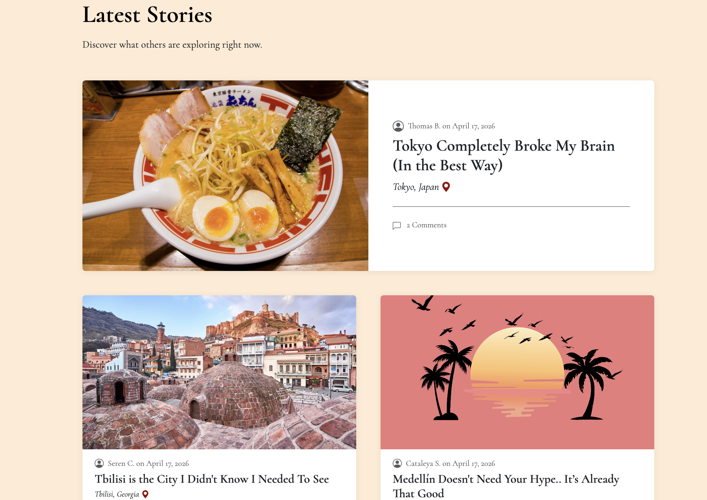
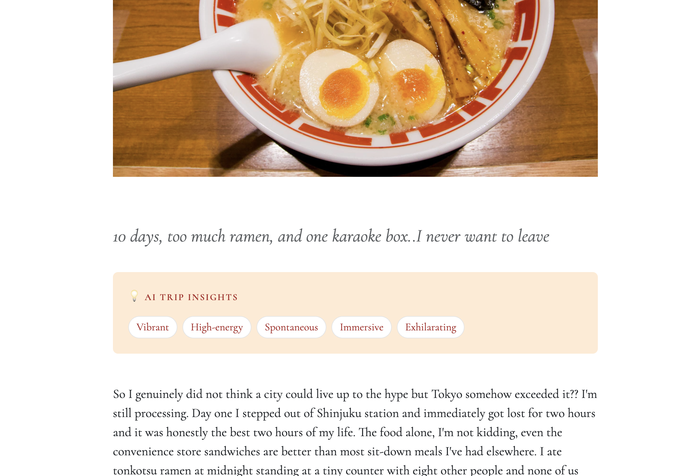

# Roam&Write

Plan less, share more. Roam&Write is a travel blog web application where users can document and share their travel experiences with readers and fellow adventurers. 
Powered by the Google Gemini API, each post surfaces AI-generated trip insights, similar destination suggestions, and an interactive AI chat assistant. 
Users can create an account, publish travel posts, browse stories from others, and engage through comments.

## Tech Stack

- **Backend:** Python, Flask, Flask-Login, Flask-Mail, Flask-WTF, SQLAlchemy, itsdangerous
- **Frontend:** HTML, CSS, Bootstrap, Bootstrap-Flask, JavaScript
- **Database:** SQLite (development) / PostgreSQL (production)
- **AI:** Google Gemini API
- **Deployment:** Heroku

## Features

- **User authentication:** register, log in, and log out securely with hashed passwords
- **Email verification:** new accounts require email verification before logging in
- **Create posts:** document a trip with a title, subtitle, destination, body, star rating, visit count, and an optional image
- **Edit & delete posts:** authors can update or remove their own posts
- **Role-based access control:** `admin_or_owner` decorator restricts post/comment deletion to owners and admins
- **Route protection:** unauthenticated users are redirected to login; missing or unauthorized resources return user-friendly flash messages
- **Comments:** authenticated users can leave comments on any post; comment authors and admins can delete comments
- **Contact form:** visitors can send a message directly through the site
- **Responsive design:** layout adapts across desktop, tablet, and mobile screen sizes

### AI Features

- **AI trip insights:** each post automatically generates atmosphere descriptors powered by Gemini
- **AI-suggested destinations:** AI suggests 3 destinations similar in character to the post, each linking to Google Flights
- **AI chat:** readers can ask Atlas, an AI travel assistant, questions about the post using multi-turn conversation

## Getting Started

Visit
 [Roam&Write](https://roam-and-write-aafc68872502.herokuapp.com/)    

